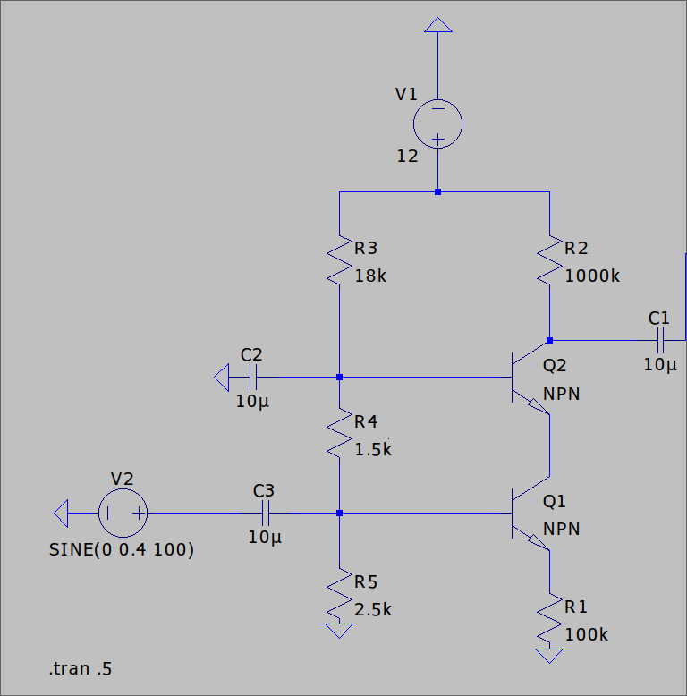
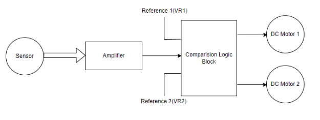

# Project B: Temperature Controller Unit

## Project Title

**Temperature Controller Unit**

## Project Statement

Design a temperature controller device that continuously senses two reference temperatures, 30°C (Lower Limit: TL) and 35°C (Higher Limit: TH). The unit should activate Motor 1 if the temperature goes below TL and activate Motor 2 if the temperature exceeds TH. If the temperature is maintained between TL and TH, both motors should remain off. The device block diagram (Fig. 1) includes an amplifier to magnify changes due to temperature variations. The amplifier operates in the linear region within the given temperature ranges.

## Technical Specifications

The product should meet the following technical specifications:

1. The product should work with the LM35 temperature sensor, with additional circuits for increased sensitivity if needed.
2. The motor will be a DC motor with a 300 RPM rating, normally operating on 12 V DC.
3. The higher and lower reference voltages (VR1 and VR2) need to be decided by the designer to suit the given temperature band requirements.
4. Only two power supplies should be provided externally, with all other supplies generated in the circuit using voltage dividers.

## Restrictions

1. The amplification part should be implemented using BJTs/MOSFETs; the use of op-amps is NOT allowed for this purpose.
2. Students can use active and passive filters as required and use the IC 741 to implement the comparison logic block.

## Solution

### Amplification

A cascode amplifier is used to amplify the output of the LM35 temperature sensor, which is 10 ± 0.2 mV/°C, to a usable voltage. The cascode amplifier is chosen due to its high gain and low temperature dependency.

### Comparison Logic

Inverting and non-inverting comparators are used to turn on one motor and turn off the other according to the amplifier's output. The IC 741 is used for implementing the comparison logic block.

### Motor Control

The L298N motor driver circuit is used to control the motors. This driver circuit allows the microcontroller to control the direction and speed of the DC motors effectively.

### Power Supply

Two external power supplies are used, and all other required voltages are generated within the circuit using voltage dividers.

## Block Diagram

## Summary

This temperature controller unit is designed to automatically manage two DC motors based on the sensed temperature. The design incorporates a cascode amplifier for its high gain and low temperature dependency, inverting and non-inverting comparators for logic control, and the L298N motor driver for motor control. The unit adheres to the given restrictions and specifications, providing an efficient solution for temperature-based motor activation.
